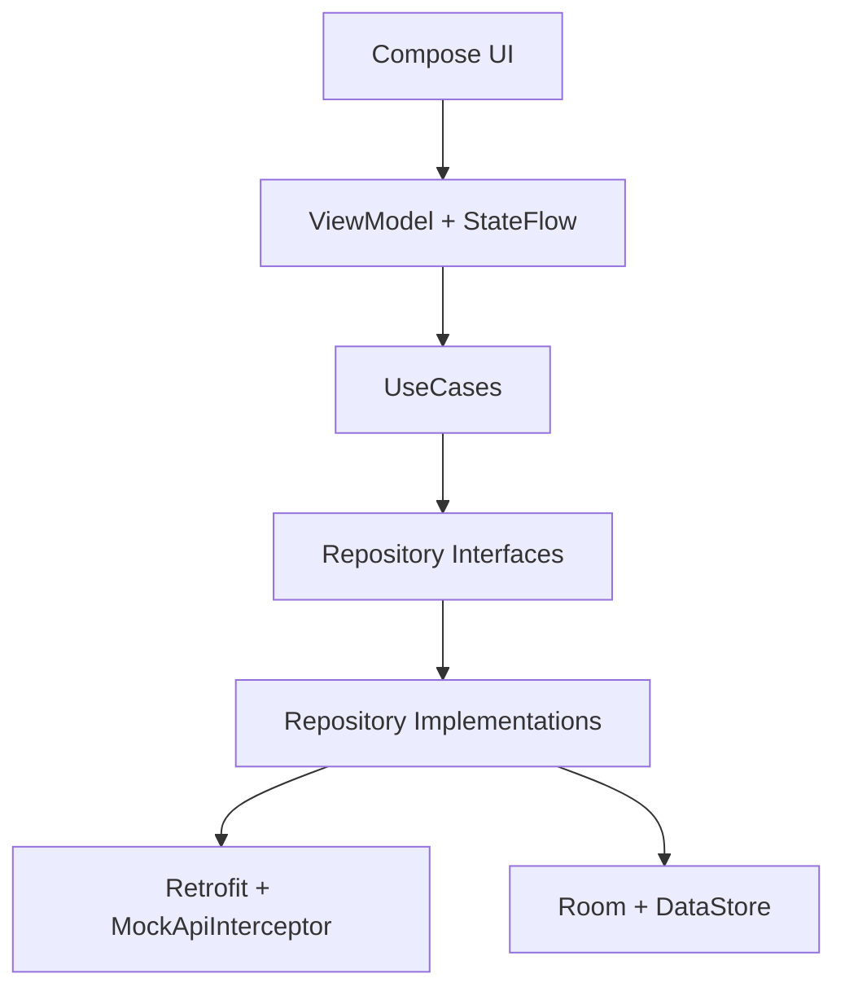

# NexCard - Next Wallet

[](https://kotlinlang.org/)
[](https://developer.android.com/jetpack/compose)
[](https://m3.material.io/)
[](https://developer.android.com/topic/architecture)

Aplicativo Android para gerenciamento de cartoes e carteira digital, com foco em fluxo principal completo, navegacao clara entre telas, dados mockados e persistencia local.

---
## Indice

- [Visao Geral](#visao-geral)
- [Arquitetura](#arquitetura)
- [Telas e Fluxo](#telas-e-fluxo)
- [Funcionalidades](#funcionalidades)
- [Tecnologias](#tecnologias)
- [Persistencia Local](#persistencia-local)
- [API Mockada](#api-mockada)
- [Estrutura de Pastas](#estrutura-de-pastas)
- [Capturas de Tela](#capturas-de-tela)
- [Como Executar](#como-executar)
- [Testes](#testes)
- [Equipe](#equipe)
- [Roadmap](#roadmap)

---
## Visao Geral

O **NexCard** simula uma experiencia de app financeiro com:

- autenticacao local;
- controle de limite por cartao;
- registro e consolidado de compras por mes;
- gerenciamento de cartao virtual;
- tema claro/escuro global;
- dados persistidos para manter o app util apos reinicializacao.

---
## Arquitetura

Projeto estruturado em **MVVM**, separando UI, regras de negocio e dados.



### Camadas principais
- `ui`: telas, componentes, navegacao, tema.
- `domain`: modelos, contratos de repositorio, casos de uso.
- `data`: local (Room), remoto mockado, implementacoes de repositorio.
- `di`: modulo Hilt para injecao de dependencias.

---
## Telas e Fluxo

### Rotas implementadas
1. `login`
2. `signup`
3. `home`
4. `cards`
5. `financial`
6. `consolidated`
7. `add_card`
8. `card_detail/{cardId}`
9. `settings`

> Observacao: o requisito academico menciona 5 a 8 telas. Atualmente o app possui 9 rotas de navegacao (incluindo a tela dedicada de consolidado).

```mermaid
flowchart LR
    A[session check] --> B[login]
    B --> C[signup]
    B --> D[home]
    C --> B
    D --> E[cards]
    D --> F[financial]
    D --> G[consolidated]
    D --> H[settings]
    E --> I[card_detail/{cardId}]
    E --> J[add_card]
    F --> G
    F --> J
    H --> B
```

---
## Funcionalidades

- Login e cadastro local com sessao persistida.
- Home com resumo financeiro e atalho para consolidado mensal.
- Lista de cartoes com destaque de cartao selecionado.
- Limites/faturas/compras com alteracao de limite e registro de compra.
- Tela de consolidado mensal por cartao/mes.
- Criacao de novo cartao com rotacao de artes dos cartoes.
- Detalhes do cartao com bloqueio/desbloqueio, numero virtual e CVV temporario.
- Configuracoes com notificacoes, tema dark/light e logout.

---
## Tecnologias

- **Linguagem:** Kotlin
- **UI:** Jetpack Compose + Material 3
- **Navegacao:** Navigation Compose
- **Arquitetura:** MVVM
- **Injecao de dependencia:** Hilt
- **Rede:** Retrofit + OkHttp
- **API fake:** `MockApiInterceptor`
- **Banco local:** Room
- **Preferencias locais:** DataStore
- **Imagem:** Coil
- **Build:** Gradle Kotlin DSL + Version Catalog
- **Testes:** JUnit

---
## Persistencia Local

### Room
Persistencia de dados principais do dominio em tabelas locais:
- usuarios
- cartoes
- transacoes
- faturas
- produtos
- historico de acoes

### DataStore
Persistencia de configuracoes e estado de sessao:
- sessao do usuario
- tema (light/dark)
- notificacoes
- ultimo cartao selecionado

---
## API Mockada

A API e simulada de forma local via interceptor, com atraso artificial para reproduzir comportamento real de rede.

**Arquivo-chave:** `app/src/main/java/com/nexcard/nextwallet/data/remote/mock/MockApiInterceptor.kt`

### Endpoints mockados
- `GET /cards`
- `GET /cards/{id}`
- `GET /products`
- `GET /transactions`
- `GET /invoices`
- `POST /cards`
- `POST /transactions`
- `PATCH /cards/{id}/status`
- `PATCH /cards/{id}/limit`

---
## Estrutura de Pastas

```text
app/src/main/java/com/nexcard/nextwallet/
|- data/
|  |- local/
|  |- remote/
|  |- repository/
|- domain/
|  |- model/
|  |- repository/
|  |- usecase/
|- ui/
|  |- components/
|  |- navigation/
|  |- screens/
|  |- theme/
|- di/
|- util/
```

---
## Capturas de Tela

### Preview atual


### Sugestao de galeria para avaliacao

> Adicione as imagens abaixo conforme for capturando cada fluxo principal.

```text
docs/screenshots/
|- home.png https://github.com/ItaloRochaj/gerenciador-cartoes/blob/main/telas%20da%20aplicacao/home.jpeg
|- cards.png https://github.com/ItaloRochaj/gerenciador-cartoes/blob/main/telas%20da%20aplicacao/cartoes.jpeg
|- financial.png https://github.com/ItaloRochaj/gerenciador-cartoes/blob/main/telas%20da%20aplicacao/limites.jpeg
|- consolidated.png https://github.com/ItaloRochaj/gerenciador-cartoes/blob/main/telas%20da%20aplicacao/consolidadofatura.jpeg
|- add-card.png https://github.com/ItaloRochaj/gerenciador-cartoes/blob/main/telas%20da%20aplicacao/novocartao.jpeg
|- card-detail.png https://github.com/ItaloRochaj/gerenciador-cartoes/blob/main/telas%20da%20aplicacao/cvv.jpeg
|- card.png https://github.com/ItaloRochaj/gerenciador-cartoes/blob/main/telas%20da%20aplicacao/destalhescartao.jpeg
|- settings.png https://github.com/ItaloRochaj/gerenciador-cartoes/blob/main/telas%20da%20aplicacao/perfil.jpeg
```

---
## Como Executar

### Pre-requisitos
- Android Studio atualizado
- JDK compativel com o projeto
- SDK Android configurado

### Build rapido (Windows PowerShell)
```powershell
Set-Location "C:\Users\irocha\AndroidStudioProjects\NextWallet"
.\gradlew.bat assembleDebug
```

### Rodar testes unitarios
```powershell
Set-Location "C:\Users\irocha\AndroidStudioProjects\NextWallet"
.\gradlew.bat :app:testDebugUnitTest --console=plain
```

---
## Testes

- Testes unitarios para regras de negocio de carteira.
- Validacoes de fluxo principal e estados de tela.
- Base para evolucao de testes instrumentados/UI.

---
## Equipe

- Audrin Lucio
- Pyetro Sabaraense
- Ernani Ferreira
- Italo Rocha

---
## Roadmap

- Adicionar capturas reais das telas no README.
- Expandir cobertura de testes instrumentados.
- Integrar backend real mantendo contratos da camada `domain`.
- Evoluir seguranca para dados sensiveis locais.

---
## Licenca

Projeto para uso academico/didatico.
