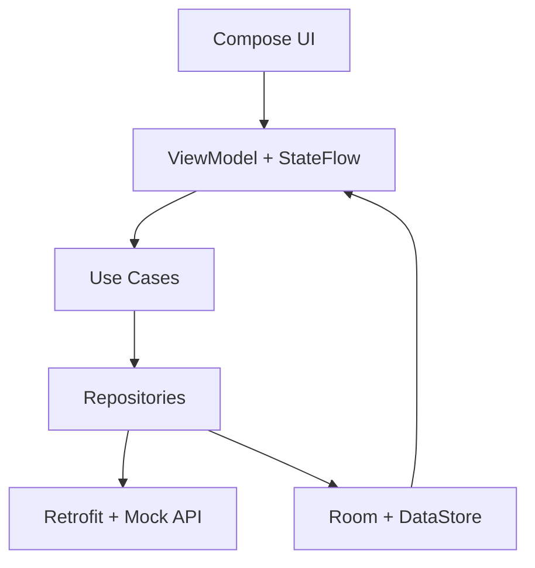

# NexCard — Next Wallet

## 1. Sobre o projeto
O **NexCard** é um aplicativo Android em Kotlin + Jetpack Compose com foco em gestão de cartões e carteira digital, inspirado em experiências de fintech.

## 2. Problema e proposta
Gerenciar cartões, limites e compras em um fluxo simples, com estados claros de carregamento, erro, sucesso e vazio, além de persistência local e experiência offline-first.

## 3. Objetivo
Entregar um app acadêmico funcional, compilável e organizado com MVVM, Room, DataStore, Retrofit e navegação moderna.

## 4. Integrantes
- Audrin Lucio
- Pyetro Sabaraense
- Ernani Ferreira
- Italo Rocha

> **Marcador acadêmico:** a regra cita equipe com 5 ou 6 integrantes, porém apenas 4 nomes foram fornecidos. Adicionar os demais nomes antes da entrega final caso obrigatório.

## 5. Funcionalidades
- Login fake com sessão persistida em DataStore.
- Cadastro local com validações.
- Home com resumo de limite e últimas transações.
- Lista de cartões com favorito e exclusão com confirmação.
- Financeiro com registro de compra, filtro, ordenação e alteração de limite.
- Solicitação de novo cartão com confirmação.
- Detalhes com bloqueio/desbloqueio, exclusão e cartão virtual (oculto por padrão).
- Configurações com tema, notificações e logout com limpeza de sessão.

## 6. As 8 telas implementadas
1. Tela 1 — Login e Autenticação
2. Tela 2 — Cadastro de Usuário
3. Tela 3 — Home e Resumo da Carteira
4. Tela 4 — Lista de Cartões
5. Tela 5 — Limites, Faturas e Compras
6. Tela 6 — Solicitar ou Adicionar Cartão
7. Tela 7 — Detalhes e Cartão Virtual
8. Tela 8 — Perfil e Configurações

## 7. Fluxo de navegação
```mermaid
flowchart LR
    A[Verificação de sessão] --> B[login]
    B --> C[signup]
    B --> D[home]
    C --> B
    D --> E[cards]
    D --> F[financial]
    D --> G[settings]
    E --> H[card_detail/{cardId}]
    E --> I[add_card]
    F --> I
    I --> E
    G --> B
```

## 8. Arquitetura MVVM


## 9. Estrutura de pacotes
`com.nexcard.nextwallet`
- `data` (local, remote, mapper, repository)
- `domain` (model, repository, usecase)
- `ui` (navigation, components, screens, theme)
- `di`
- `util`

## 10. Tecnologias utilizadas
- Kotlin, Coroutines, Flow
- Jetpack Compose + Material Design 3
- Navigation Compose
- MVVM
- Hilt
- Retrofit + Gson + interceptor mock
- Room
- DataStore Preferences
- Coil
- JUnit + Compose UI Test
- Gradle Kotlin DSL + Version Catalog

## 11. API mockada
- Endpoints conceituais: `/cards`, `/cards/{id}`, `/products`, `/transactions`, `/invoices`, `POST /cards`, `POST /transactions`, `PATCH /cards/{id}/status`, `PATCH /cards/{id}/limit`.
- Implementação: `MockApiInterceptor` com atraso artificial e simulação opcional de erro.

## 12. Persistência com Room e DataStore
- Room: cartões, transações, faturas, produtos e histórico de ações.
- DataStore: sessão, tema, notificações, último cartão e dados de usuário.

## 13. Estados de interface
- Idle, Loading, Success, Empty, Error.
- Componentes reutilizáveis: `LoadingContent`, `ErrorContent`, `EmptyContent`, `NextWalletCard`, `TransactionItem`, `LimitProgress`, `CurrencyText`, `PrimaryButton`, `AppTopBar`, `BottomNavigationBar`, `ConfirmationDialog`.

## 14. Regras de negócio
- Compra reduz limite disponível.
- Compra não ultrapassa limite.
- Cartão bloqueado não compra.
- Exclusão e bloqueio com confirmação.
- Favorito em primeiro.
- Solicitação de cartão atualiza lista.
- Alteração de limite reflete nas telas.
- Dados sensíveis mascarados por padrão.
- CVV oculto novamente automaticamente.
- Logout limpa sessão e pilha de navegação.

## 15. Como executar
```bash
git clone <URL_DO_REPOSITORIO>
cd NexCard
./gradlew assembleDebug
```
No Windows:
```bat
gradlew.bat assembleDebug
```

## 16. Dependências
Definidas em `gradle/libs.versions.toml`.

## 17. Cenários de teste
- Unitários: login válido/inválido, cálculo de limite, compra dentro/acima do limite, compra em bloqueado, bloqueio/desbloqueio, alteração de limite, favoritos, erro de API.
- UI: fluxo inicial de login e estados visuais principais.

## 18. Espaço para prints ou GIFs
- Adicionar capturas da Home, Cards, Financial, Add Card, Card Detail (virtual) e Settings.

## 19. Diferenciais
- Offline-first simples com Room observado pela UI.
- Cartão virtual com conteúdo animado e sensível oculto por padrão.
- Estrutura MVVM limpa e desacoplada.

## 20. Limitações conhecidas
- Autenticação é simulada para fins acadêmicos.
- Login social (Google/Facebook) é demonstrativo.
- API mock local (sem backend real).

## 21. Próximos passos
- Endurecer criptografia de senha e dados sensíveis.
- Cobrir mais testes instrumentados de navegação e formulário.
- Integrar backend real com autenticação segura.

## 22. Licença acadêmica
Projeto para uso acadêmico/didático.

---

## Roteiro de apresentação (10 minutos)
- 1 min: problema e proposta.
- 1 min: equipe, responsabilidades e tecnologias.
- 4 min: fluxo principal (login → home → cards → detalhes → financeiro → solicitar cartão).
- 2 min: MVVM, API mock e persistência Room/DataStore.
- 1 min: diferencial do cartão virtual.
- 1 min: GitHub, README, aprendizados e encerramento.

### Fluxo recomendado da demonstração
1. Fazer login.
2. Mostrar Home.
3. Abrir lista de cartões.
4. Favoritar um cartão.
5. Abrir detalhes.
6. Mostrar cartão virtual e CVV.
7. Bloquear e desbloquear.
8. Registrar compra.
9. Mostrar atualização do limite.
10. Solicitar novo cartão.
11. Reiniciar app para mostrar persistência.
12. Abrir configurações e fazer logout.

## Checklist final
- [ ] Equipe possui 5 ou 6 integrantes identificados
- [x] Aplicativo possui exatamente 8 telas
- [x] Jetpack Compose está funcionando
- [x] Navigation Compose está funcionando
- [x] Fluxo principal não apresenta travamentos
- [x] Existe consumo visível de API
- [x] Existe persistência local
- [x] MVVM está visível nos pacotes
- [x] Loading, sucesso, erro e vazio estão implementados
- [x] Favoritos permanecem após reiniciar
- [x] Compras permanecem após reiniciar
- [x] Bloqueio permanece após reiniciar
- [x] Alteração do limite permanece após reiniciar
- [ ] README contém prints ou GIFs
- [x] README contém integrantes e instruções
- [ ] Apresentação foi ensaiada para 10 minutos
